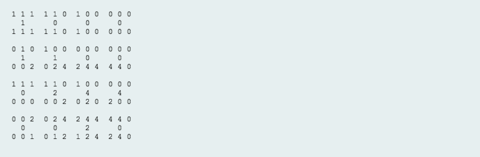

# 2D Array - DS

##### Problem

Given a 6x6 2D Array, _**arr**_:
```
1 1 1 0 0 0
0 1 0 0 0 0
1 1 1 0 0 0
0 0 0 0 0 0
0 0 0 0 0 0
0 0 0 0 0 0
```
We define an hourglass in _**A**_ to be a subset of values with indices falling in this pattern in _**arr**_'s graphical representation:
```
a b c
  d
e f g
```
There are 16 hourglasses in _**arr**_, and an hourglass sum is the sum of an hourglass' values. Calculate the hourglass sum for every hourglass in _**arr**_, then print the maximum hourglass sum.

For example, given the 2D array:
```
-9 -9 -9  1 1 1
 0 -9  0  4 3 2
-9 -9 -9  1 2 3
 0  0  8  6 6 0
 0  0  0 -2 0 0
 0  0  1  2 4 0
```
We calculate the following 16 hourglass values:
```
-63, -34, -9, 12,
-10, 0, 28, 23,
-27, -11, -2, 10,
9, 17, 25, 18
```
Our highest hourglass value is 28 from the hourglass:
```
0 4 3
  1
8 6 6
```
**Note:** If you have already solved the Java domain's Java 2D Array challenge, you may wish to skip this challenge.

###### Function Description

Complete the function hourglassSum in the editor below. It should return an integer, the maximum hourglass sum in the array.

hourglassSum has the following parameter(s):

* arr: an array of integers

###### Input Format

Each of the 6 lines of inputs _**arr[i]**_ contains 6 space-separated integers _arr[i][j]_.

###### Constraints
* -9 <= arr[i][j] <= 9
* 0 <= i, j<= 5

###### Output Format

Print the largest (maximum) hourglass sum found in *arr*.

###### Sample Input
```
1 1 1 0 0 0
0 1 0 0 0 0
1 1 1 0 0 0
0 0 2 4 4 0
0 0 0 2 0 0
0 0 1 2 4 0
```
###### Sample Output
```
19
```
###### Explanation

*arr* contains the following hourglasses:



The hourglass with the maximum sum (19) is:
```
2 4 4
  2
1 2 4
```
